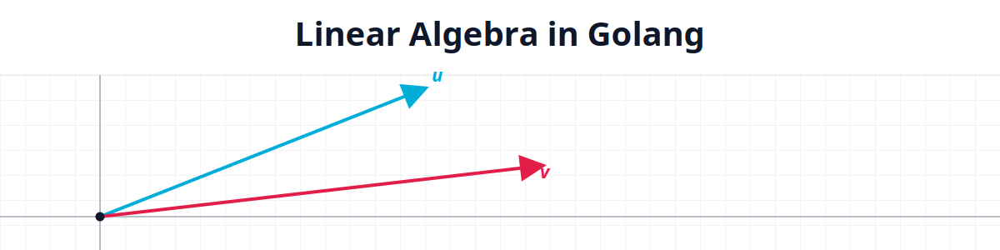

<p align="center">
  
</p>

# Linear Algebra in Go

A from-scratch implementation of core linear algebra primitives in Go, built one exercise at a time. There are no external math dependencies — every operation (vector arithmetic, matrix multiplication, row echelon form, determinants, inversion, rank) is implemented directly on top of Go's generics, using `Vector[K]` and `Matrix[K]` types that work over any numeric type.

Each exercise (`ex00`–`ex13`) is a self-contained Go module folder with its own `vector`/`matrix` package and a `cmd/main.go` demo you can run directly. Later exercises build on the types and files introduced earlier, so the project reads as a progression: simple vector arithmetic first, then matrix arithmetic, then the more involved reductions (row echelon form, determinant, inverse, rank).

## Running an exercise

Each exercise has its own runnable demo:

```bash
go run ./ex13/cmd
```

## Topics covered

| Exercise | Topic | What it adds |
|---|---|---|
| [ex00](ex00) | Vector & matrix basics | `Add`, `Sub`, `Scl` for both `Vector[K]` and `Matrix[K]` |
| [ex01](ex01) | Linear combination | `LinearCombination` of vectors weighted by scalar coefficients |
| [ex02](ex02) | Linear interpolation | `Lerp` for plain numbers, vectors, and matrices |
| [ex03](ex03) | Dot product | `Dot` product between two vectors |
| [ex04](ex04) | Vector norms | `Norm1` (Manhattan), `Norm` (Euclidean), `NormInf` (max) |
| [ex05](ex05) | Angle between vectors | `AngleCos` — cosine of the angle via dot product and norms |
| [ex06](ex06) | Cross product | `CrossProduct` for 3D vectors |
| [ex07](ex07) | Matrix × vector, matrix × matrix | `MulVector`, `MulMatrix` |
| [ex08](ex08) | Trace | `Trace` — sum of the diagonal |
| [ex09](ex09) | Transpose | `Transpose` |
| [ex10](ex10) | Row echelon form | `RowEchelon` — Gaussian elimination with pivoting, including edge cases (zero rows, non-square, swaps) |
| [ex11](ex11) | Determinant | `Determinant`, generalized to any square size |
| [ex12](ex12) | Inverse | `Inverse` via row reduction, including singular-matrix detection |
| [ex13](ex13) | Rank | `Rang` — matrix rank derived from row echelon form |

## Project layout

Every exercise follows the same shape:

```
exNN/
├── cmd/main.go       # runnable demo for this exercise's new operation(s)
├── vector/           # Vector[K] type and its operations (whichever exercise needs it)
└── matrix/           # Matrix[K] type and its operations (whichever exercise needs it)
```

Each exercise only carries the packages it actually needs — e.g. `ex04`–`ex06` are vector-only, while `ex08`–`ex13` are matrix-only. Package contents also carry forward: each new exercise copies and extends the previous exercise's `vector`/`matrix` package with one additional operation.

`errors.go` in each package defines the sentinel errors (e.g. `ErrMatrixSingular`, size-mismatch errors) returned by operations that can fail, keeping error handling explicit rather than relying on panics.
